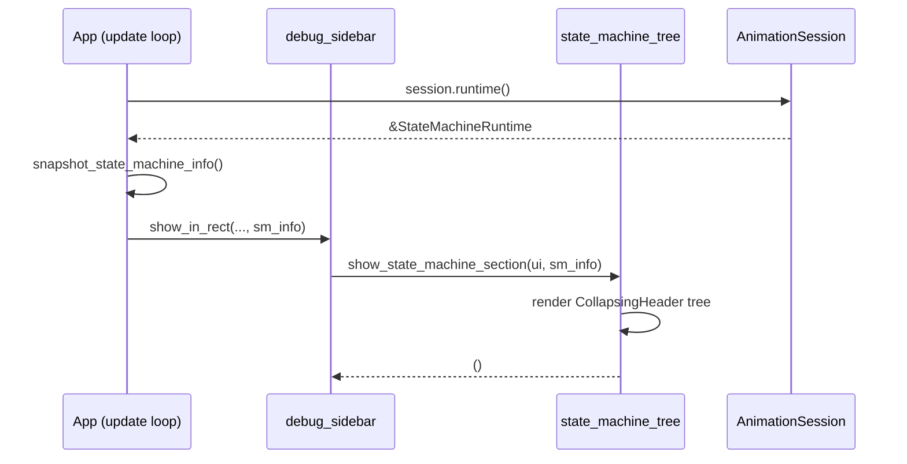

# Design Document: State Machine Sidebar Panel

## Overview

在左侧调试侧边栏底部（Resource Tree 下方）新增一个 "State Machine" 折叠树面板，实时展示当前动画状态机的运行状态。面板包含：当前状态、转场信息、场景时间、各状态本地时间、以及所有动画 override 值。所有浮点数格式化为两位小数。

## Main Algorithm/Workflow



## Core Interfaces/Types

```rust
/// 状态机面板所需的快照数据，每帧从 AnimationSession 提取。
/// 使用独立结构体避免在 UI 层直接持有 runtime 引用。
#[derive(Debug, Clone, Default)]
pub struct StateMachineSnapshot {
    /// 状态机名称 (来自 StateMachine.name)
    pub name: String,
    /// 状态机 id
    pub id: String,
    /// 当前活跃状态 id
    pub current_state_id: String,
    /// 当前活跃状态名称（用于显示）
    pub current_state_name: String,
    /// 是否已结束（到达 exit state）
    pub finished: bool,
    /// 场景累计时间（秒）
    pub scene_time_secs: f64,
    /// 活跃转场 id（如果正在转场）
    pub active_transition_id: Option<String>,
    /// 转场混合因子 0.0 → 1.0
    pub transition_blend: Option<f64>,
    /// 转场源状态名称
    pub transition_source_name: Option<String>,
    /// 转场目标状态名称
    pub transition_target_name: Option<String>,
    /// 所有状态的定义信息（id, name, type）
    pub states: Vec<StateInfo>,
    /// 各状态本地经过时间
    pub state_local_times: Vec<(String, f64)>,
    /// 当前活跃的动画 override 值
    pub override_values: Vec<(String, String)>,
}

/// 单个状态的摘要信息
#[derive(Debug, Clone)]
pub struct StateInfo {
    pub id: String,
    pub name: String,
    pub state_type: String,
    pub is_current: bool,
}
```

## Key Functions with Formal Specifications

### Function 1: `snapshot_from_session`

```rust
pub fn snapshot_from_session(session: &AnimationSession) -> StateMachineSnapshot
```

**Preconditions:**
- `session` 是有效的 `AnimationSession` 引用

**Postconditions:**
- 返回的 `StateMachineSnapshot` 包含 runtime 的当前状态快照
- `states` 包含定义中所有状态
- `override_values` 中的值已格式化为两位小数（数值类型）
- `state_local_times` 按状态 id 排序

**Loop Invariants:** N/A

### Function 2: `show_state_machine_section`

```rust
pub fn show_state_machine_section(ui: &mut egui::Ui, snapshot: &StateMachineSnapshot)
```

**Preconditions:**
- `ui` 是有效的 egui UI 上下文
- `snapshot` 是当前帧的状态机快照

**Postconditions:**
- 在 UI 中渲染 "State Machine" section，包含以下子树：
  - Status: 当前状态、是否完成
  - Transition: 转场信息（如果有）
  - States: 所有状态列表及本地时间
  - Values: 所有 override 值（格式化两位小数）
- 不产生副作用（纯展示）

**Loop Invariants:** N/A

### Function 3: `format_f64_2dp`

```rust
fn format_f64_2dp(v: f64) -> String
```

**Preconditions:**
- `v` 是有效的 f64 值

**Postconditions:**
- 返回格式化为两位小数的字符串，如 `"3.14"`
- 对 NaN 返回 `"NaN"`，对 Inf 返回 `"Inf"`

**Loop Invariants:** N/A


## Algorithmic Pseudocode

### 快照提取算法

```rust
pub fn snapshot_from_session(session: &AnimationSession) -> StateMachineSnapshot {
    let runtime = session.runtime();
    let def = runtime.definition();
    let current_id = runtime.current_state_id();

    // 构建状态信息列表
    let states: Vec<StateInfo> = def.states.iter().map(|s| {
        StateInfo {
            id: s.id.clone(),
            name: s.name.clone(),
            state_type: format!("{:?}", s.resolved_type()),
            is_current: s.id == current_id,
        }
    }).collect();

    // 查找当前状态名称
    let current_state_name = def.states.iter()
        .find(|s| s.id == current_id)
        .map(|s| s.name.clone())
        .unwrap_or_else(|| current_id.to_string());

    // 查找转场源/目标名称（从 definition.transitions 中匹配）
    let (transition_source_name, transition_target_name) = runtime
        .active_transition_id()
        .and_then(|tid| def.transitions.iter().find(|t| t.id == tid))
        .map(|t| {
            let src = def.states.iter().find(|s| s.id == t.source)
                .map(|s| s.name.clone()).unwrap_or(t.source.clone());
            let tgt = def.states.iter().find(|s| s.id == t.target)
                .map(|s| s.name.clone()).unwrap_or(t.target.clone());
            (Some(src), Some(tgt))
        })
        .unwrap_or((None, None));

    StateMachineSnapshot {
        name: def.name.clone(),
        id: def.id.clone(),
        current_state_id: current_id.to_string(),
        current_state_name,
        finished: runtime.finished,
        scene_time_secs: session.scene_time(),
        active_transition_id: runtime.active_transition_id().map(str::to_string),
        transition_blend: None, // 从最近的 AnimationStep 获取
        transition_source_name,
        transition_target_name,
        states,
        state_local_times: Vec::new(), // 从最近的 AnimationStep 获取
        override_values: Vec::new(),   // 从最近的 AnimationStep 获取
    }
}
```

### UI 渲染算法

```rust
pub fn show_state_machine_section(ui: &mut egui::Ui, snapshot: &StateMachineSnapshot) {
    two_column_section::section(ui, "State Machine", |ui| {
        // ── Status 子树 ──
        egui::CollapsingHeader::new("Status")
            .default_open(true)
            .show(ui, |ui| {
                label_value(ui, "Name", &snapshot.name);
                label_value(ui, "Current State", &snapshot.current_state_name);
                label_value(ui, "Scene Time", &format_f64_2dp(snapshot.scene_time_secs));
                label_value(ui, "Finished", &snapshot.finished.to_string());
            });

        // ── Transition 子树（仅在转场时显示） ──
        if snapshot.active_transition_id.is_some() {
            egui::CollapsingHeader::new("Transition")
                .default_open(true)
                .show(ui, |ui| {
                    if let Some(ref src) = snapshot.transition_source_name {
                        label_value(ui, "From", src);
                    }
                    if let Some(ref tgt) = snapshot.transition_target_name {
                        label_value(ui, "To", tgt);
                    }
                    if let Some(blend) = snapshot.transition_blend {
                        label_value(ui, "Blend", &format_f64_2dp(blend));
                    }
                });
        }

        // ── States 子树 ──
        egui::CollapsingHeader::new("States")
            .default_open(false)
            .show(ui, |ui| {
                for (state_id, local_time) in &snapshot.state_local_times {
                    let info = snapshot.states.iter().find(|s| s.id == *state_id);
                    let label = info.map(|s| s.name.as_str()).unwrap_or(state_id.as_str());
                    let marker = if info.map(|s| s.is_current).unwrap_or(false) { " ●" } else { "" };
                    label_value(ui, &format!("{label}{marker}"), &format_f64_2dp(*local_time));
                }
            });

        // ── Values 子树 ──
        egui::CollapsingHeader::new("Values")
            .default_open(true)
            .show(ui, |ui| {
                if snapshot.override_values.is_empty() {
                    ui.label("(no active overrides)");
                } else {
                    for (key, value) in &snapshot.override_values {
                        label_value(ui, key, value);
                    }
                }
            });
    });
}

fn label_value(ui: &mut egui::Ui, label: &str, value: &str) {
    ui.horizontal(|ui| {
        ui.label(label);
        ui.with_layout(egui::Layout::right_to_left(egui::Align::Center), |ui| {
            ui.monospace(value);
        });
    });
}

fn format_f64_2dp(v: f64) -> String {
    if v.is_nan() { return "NaN".to_string(); }
    if v.is_infinite() { return "Inf".to_string(); }
    format!("{:.2}", v)
}
```

### Override 值格式化算法

```rust
/// 将 serde_json::Value 格式化为两位小数的显示字符串
fn format_json_value_2dp(value: &serde_json::Value) -> String {
    match value {
        serde_json::Value::Number(n) => {
            format_f64_2dp(n.as_f64().unwrap_or(0.0))
        }
        serde_json::Value::Array(arr) => {
            let parts: Vec<String> = arr.iter().map(|v| {
                v.as_f64()
                    .map(format_f64_2dp)
                    .unwrap_or_else(|| v.to_string())
            }).collect();
            format!("[{}]", parts.join(", "))
        }
        serde_json::Value::Bool(b) => b.to_string(),
        serde_json::Value::String(s) => s.clone(),
        other => other.to_string(),
    }
}
```

## Example Usage

```rust
// 在 App::update() 中，构建快照并传递给侧边栏
// (src/app/mod.rs — App::update 方法内)

let sm_snapshot = self.animation_session.as_ref().map(|session| {
    let mut snap = snapshot_from_session(session);
    // 补充来自最近 AnimationStep 的动态数据
    // （state_local_times, transition_blend, override_values
    //   在 step() 调用后缓存到 App 上）
    snap.state_local_times = self.cached_state_local_times.clone();
    snap.transition_blend = self.cached_transition_blend;
    snap.override_values = self.cached_override_values.clone();
    snap
});

// 在 show_in_rect 调用中传入 sm_snapshot
debug_sidebar::show_in_rect(
    ctx, ui,
    // ... 现有参数 ...
    sm_snapshot.as_ref(),
);

// 在 show_in_rect 内部，Resource Tree 之后添加：
if let Some(sm) = sm_snapshot {
    section_divider(ui);
    with_sidebar_content_padding(ui, |ui| {
        show_state_machine_section(ui, sm);
    });
}
```

## Correctness Properties

*属性是系统在所有有效执行中应保持为真的特征或行为——本质上是关于系统应该做什么的形式化陈述。属性作为人类可读规范与机器可验证正确性保证之间的桥梁。*

### Property 1: format_f64_2dp 对有限值始终返回两位小数

*For any* 有限 f64 值 v（非 NaN、非无穷大），format_f64_2dp(v) 的返回值 SHALL 匹配正则表达式 `^-?\d+\.\d{2}$`。对于 NaN 返回 `"NaN"`，对于无穷大返回 `"Inf"`。

**Validates: Requirements 2.1, 2.2, 2.3, 3.2, 4.3, 5.3, 6.3**

### Property 2: 快照 states 数量等于定义中的 states 数量

*For any* AnimationSession，snapshot_from_session(session).states.len() SHALL 等于 session.runtime().definition().states.len()。

**Validates: Requirement 1.2**

### Property 3: 恰好有一个状态标记为 is_current

*For any* StateMachineSnapshot，states 列表中恰好有一个状态的 is_current 字段为 true。

**Validates: Requirement 1.3**

### Property 4: JSON 值格式化保持类型语义

*For any* serde_json::Value，若为数值类型则格式化为两位小数字符串；若为数值数组则每个数值元素分别格式化为两位小数并以 `[a, b, ...]` 格式输出；若为布尔或字符串类型则直接输出原始值。

**Validates: Requirements 2.4, 2.5**

### Property 5: 转场一致性——无转场 id 则无混合因子

*For any* StateMachineSnapshot，若 active_transition_id 为 None，则 transition_blend SHALL 为 None。

**Validates: Requirement 4.4**
